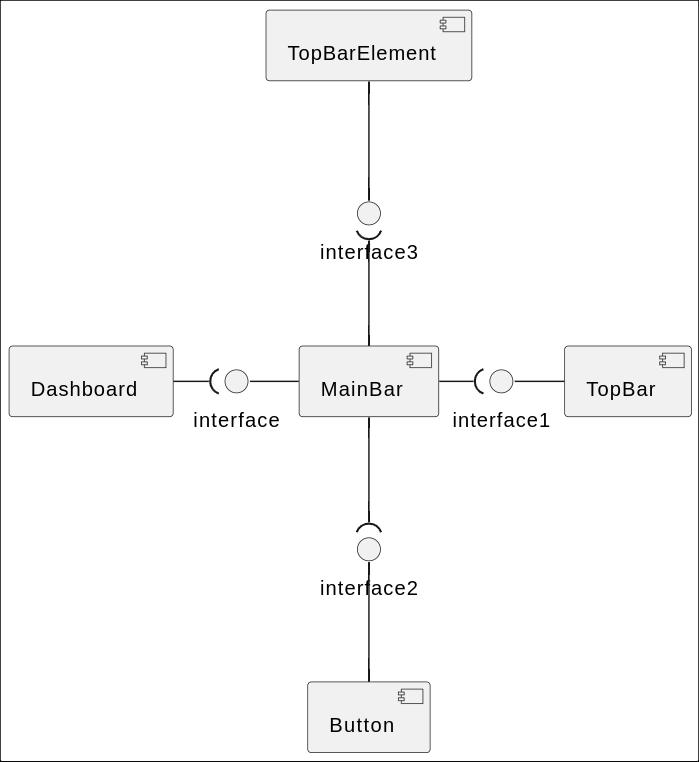
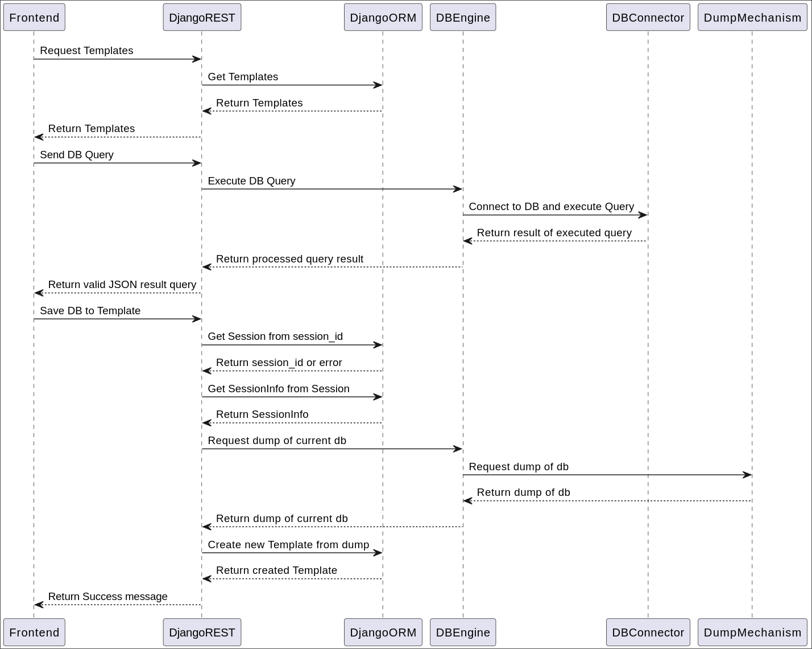
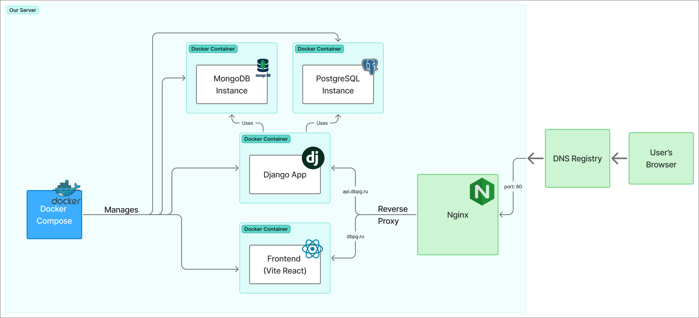

<div align="center">
    
    <h1>Database Playground</h1>
    <p>Online platform for learning databases</p>
</div>

## Launch/Access instructions
### You can visit [deployed version](https://dbpg.ru)
### Or you can build the app yourself:

1. Clone the repo:
```sh
$ git clone https://github.com/Delta-Software-Innopolis/Database-Playground
$ cd Database-Playground
```
2. In order for app to run you need `.env` and `db.sqlite3`, you can take sample data from the `deploy` directory:
```sh
$ cp deploy/db.sqlite backend/core/db.sqlite3
$ cp deploy/.env.sample .env
```
3. Run the app via `Docker Compose` (Install it [here](https://docs.docker.com/compose/install/)):
```sh
$ docker compose up --build
```
4. Working version should be available at http://localhost:5173

## Architecture
### Static View
#### Components of backend


#### Components of Frontend:
Our frontend architecture uses many small single responsibility components combined togheter. This ensures modularity and reusability in the application. 
- Playground Page


- Template Choice Page


- Dashboard Page


### Dynamic View
#### Sequence Diagram of Main Backend Workflows
These scenarios executes almost instantly, as each of them is mostly IO bound tasks


### Deployment View


## Development
This section documents the development policies used in the project.

### Kanban board
We use a **GitHub Projects Kanban board** to track progress:

**[🔗 View our Kanban Board](https://github.com/orgs/Delta-Software-Innopolis/projects/1/views/1)**

#### Entry Criteria

| Column | Entry Criteria |
|--------|----------------|
| Todo | Issues must have a clear description and acceptance criteria. |
| In Progress | Issues must have owner(s) assigned to them and be actively worked on (preferably, in a separate branch).  |
| On Review | Issues must be resolved with a pull request that is being actively reviewed. |
| Done | Issues must be resolved and closed (a pull request is not necessary). |
| Cancelled | Issues must be closed due to being cancelled. |

### Git workflow

We adapted GitHub Flow with slight modifications for our CI/CD pipeline.

#### Rules

**1. Creating issues**

- Use the predefined issue templates:
    - [Bug Report](https://github.com/Delta-Software-Innopolis/Database-Playground/blob/pre-chroma/.github/ISSUE_TEMPLATE/bug_report.md)
    - [Technical Task](https://github.com/Delta-Software-Innopolis/Database-Playground/blob/pre-chroma/.github/ISSUE_TEMPLATE/technical-task.md)
    - [User Story](https://github.com/Delta-Software-Innopolis/Database-Playground/blob/pre-chroma/.github/ISSUE_TEMPLATE/user-story.md)
- Assign labels (e.g., `Bug`, `Feature`, `Frontend`, `Backend`, etc.).

**2. Branching**

- Name branches as:
`<issue number>-<issue name (shortened)>`
    - Example:
    `85-refactor-mongoengine`

- Create new branches from the development branch (currently, `pre-chroma`).

**3. Commit Messages**

Follow Conventional Commits:

```
<type>(<optional scope>): <description>

<optional body>

<optional footer>
```

**4. Pull Requests (PRs)**

- Use the **[PR Template](https://github.com/Delta-Software-Innopolis/Database-Playground/blob/pre-chroma/.github/pull_request_template.md)**.

    - Link to the issue (e.g., Closes #123).

    - Require at least one approval before merging.

- Direct pushes to development branch are allowed for minor fixes/urgent changes.

**5. Merging**

- No enforced squashing: Merge commits are preserved.

- Merged branches are kept (not automatically deleted) to prevent accidental overwrites.

**6. Code Reviews**

- For PRs only:

    - At least one approval required.

    - Reviewers check for code quality and adherence to standards.

**7. Resolving Issues**

- Automatically: Issues linked to PRs via Closes #123 are closed when the PR merges.

- Manually: If pushed directly to the development branch, close the issue after verifying the changes are deployed.

- Reopen if the fix is incomplete or regresses.

#### Git Workflow Diagram


### Secrets management

- **Never commit secrets** to version control!

- Store secrets in:

    - GitHub Actions Secrets (for CI/CD).

    - `.env` files (added to `.gitignore`).

## Quality Assurance
### Quality attribute scenarios
[Link](https://github.com/Delta-Software-Innopolis/Database-Playground/blob/pre-chroma/docs/quality-assurance/quality-attribute-scenarios.md) for quality attribute scenarios

### Automated tests
Backend testing is done via PyTest package
Mainly, Integration testing is implemented, to check how program works in bound with exact database management systems (e.g PostgreSQL or MongoDB)
Unit tests are implemented to, to check some inner logic (e.g query parsing for MongoEngine)

All the tests are in [backend/tests](backend/tests) directory
The integration tests are marked with special decorator (@integration_test)
The decorator skips the test if INTEGRATION_TEST environment variable is not set or set false

Testing pipeline should be activated with scripts in [backend/scripts](backend/scripts) directory

```shell
# make sure to activate python virtual environment 
# and install required packages

cd backend
./scripts/run_unit_tests.sh  # runs pytest without INTEGRATION_TEST env var


# If you want to run integration testing

docker compose up -d
./scripts/run/all_tests.sh  # runs pytest with INTEGRATION_TEST env var
```

## Build and deployment
### Continuous Integration
- [backend.yml](https://github.com/Delta-Software-Innopolis/Database-Playground/blob/pre-chroma/.github/workflows/backend.yml):
  - isort - sorting imports for easier readability
  - flake8 - linter for python code
  - pytest (via script) - run unit tests for the app
- [frontend.yml](https://github.com/Delta-Software-Innopolis/Database-Playground/blob/pre-chroma/.github/workflows/frontend.yml):
  - ESLint - linter for JavaScript code
  - Prettier - formatter for JavaScript and CSS
  - Dependency cruiser - Validating frontend code dependencies
- [deploy.yml](https://github.com/Delta-Software-Innopolis/Database-Playground/blob/pre-chroma/.github/workflows/deploy.yml):
  - Github - to fetch the newest version of the code and run this workflow
  - SSH - to connect to the server and deploy
  - Docker Compose - to easily build and run code
  - [All workflow runs](https://github.com/Delta-Software-Innopolis/Database-Playground/actions)
