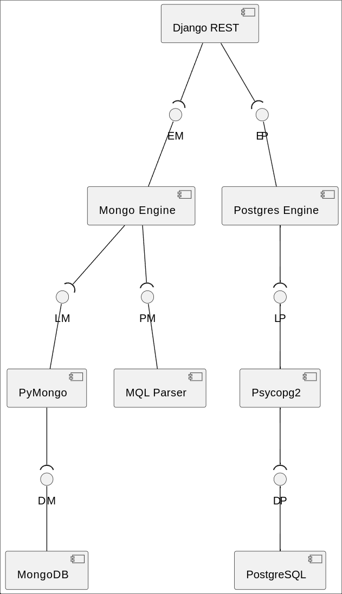
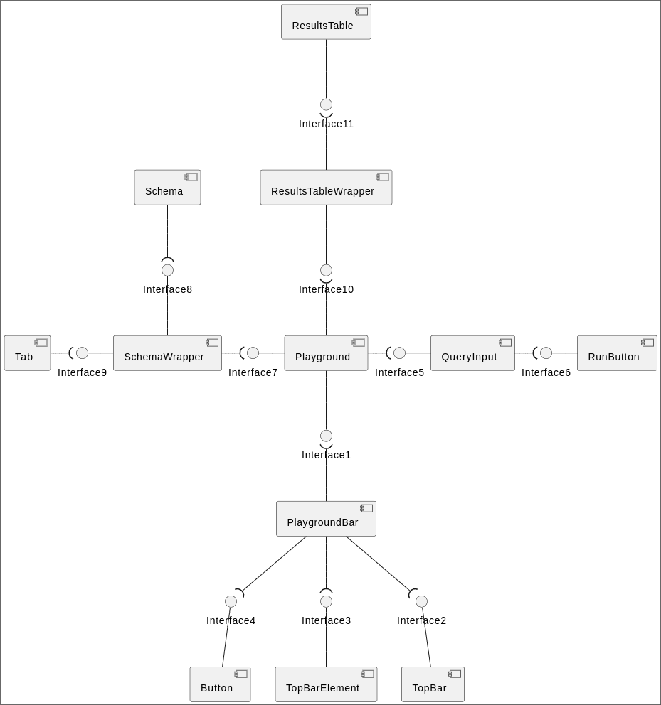
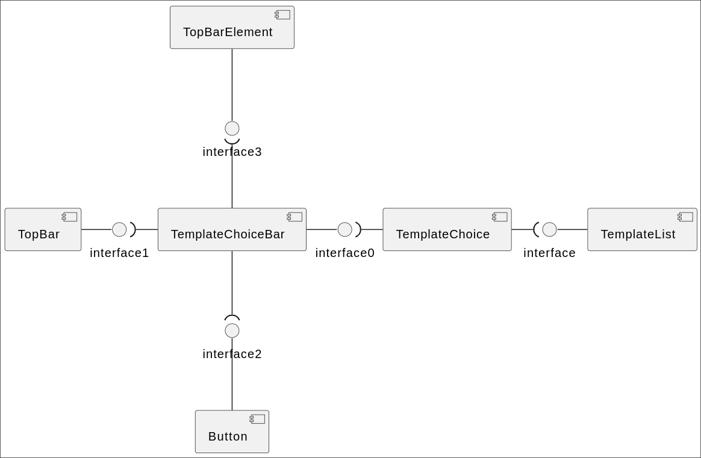
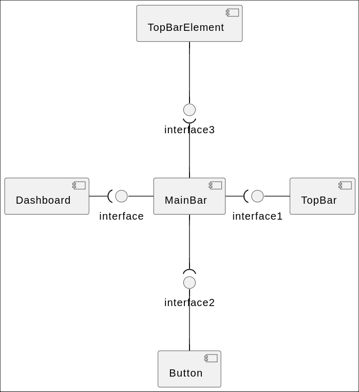
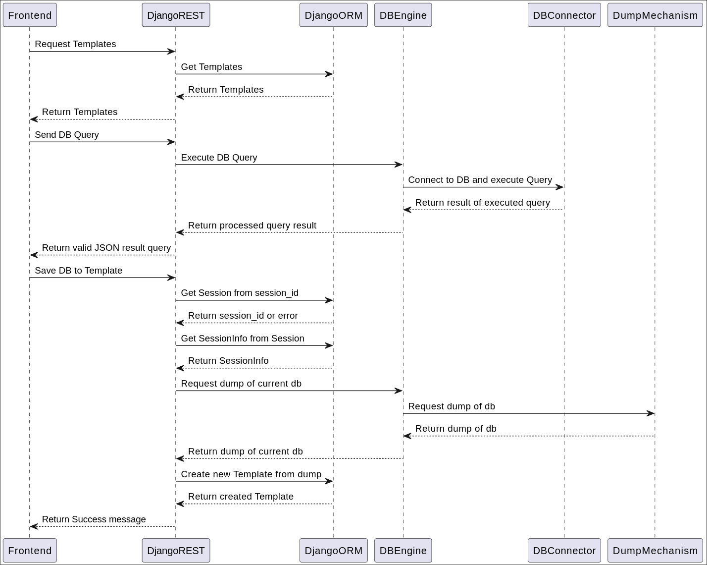
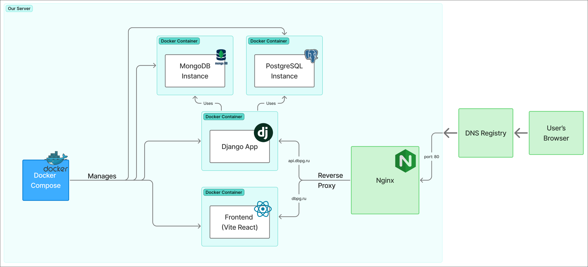

## Architecture

### Static View

#### Components of backend

#### Components of Frontend:

Our frontend architecture uses many small single responsibility components combined togheter. This ensures modularity and reusability in the application.

- Playground Page
  

- Template Choice Page
  

- Dashboard Page
  

### Dynamic View

#### Sequence Diagram of Main Backend Workflows

These scenarios executes almost instantly, as each of them is mostly IO bound tasks

### Deployment View

